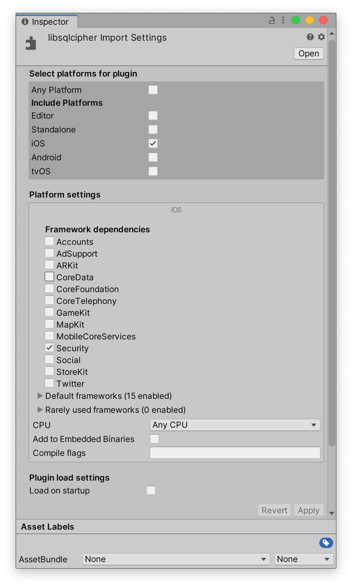

# SQLite4Unity3D_iOS

## Binairies in repository

We already built default binaries for some versions and pushed in this repository.

## Shell script
SQLite4Unity3D build bundle for iOS©. 

Use with https://github.com/netpyoung/SQLite4Unity3D .

You need :
- **Apple©** computer with **macOS 10.15**
- install **Xcode 11.3**
- install **Xcode tools** 
- Active **Command Lines Tools** (in **Xcode Preferences>Locations**)

## Use the SQLiteBuilt_iOS.sh

Use the SQLiteBuilt_iOS.sh default

```
cd <this directory>
./SQLiteBuilt_iOS.sh <year> <version example:4.3.0>
```
All is automatic!

## Custom the SQLiteBuilt_iOS.sh

Open the SQLiteBuilt_iOS.sh, find the lines and edit your config

```
./configure \
--enable-tempstore=no \
--enable-load-extension \
--disable-tcl \
CFLAGS="\
-arch x86_64 \
-miOS-version-min=10.10 \
" \
LDFLAGS="\
-framework Security \
-framework Foundation \
"
```

save and execute:

```
cd <this directory>
./SQLite_iOS.sh <version example:4.3.0>
```
All is automatic!

## Copy in Unity3D project

Copy in "**Plugins**" (create one if necessary) folder in Unity3D, select each file and check in "Inspector" :

### iOS

For the file **/Plugins/iOS/libsqlite.a**



## LICENCES

| project                                                        | license                                                                      |
|----------------------------------------------------------------|------------------------------------------------------------------------------|
| this shell script                                        | is copyleft!
| [Sqlite-net](https://github.com/praeclarum/sqlite-net)         | [MIT](https://github.com/praeclarum/sqlite-net/blob/master/LICENSE.txt)      |
| [SQLite](sqlite370_banner.gif)                                 | [SQLite's License](https://sqlite.org/copyright.html)                        |

### SQLite's License

``` license
All of the code and documentation in SQLite has been dedicated to the public domain by 
the authors. All code authors, and representatives of the companies they work for, have
signed affidavits dedicating their contributions to the public domain and originals of 
those signed affidavits are stored in a firesafe at the main offices of Hwaci. Anyone 
is free to copy, modify, publish, use, compile, sell, or distribute the original SQLite
code, either in source code form or as a compiled binary, for any purpose, commercial 
or non-commercial, and by any means.

The previous paragraph applies to the deliverable code and documentation in SQLite - 
those parts of the SQLite library that you actually bundle and ship with a larger 
application. Some scripts used as part of the build process (for example the "configure"
scripts generated by autoconf) might fall under other open-source licenses. Nothing 
from these build scripts ever reaches the final deliverable SQLite library, however, 
and so the licenses associated with those scripts should not be a factor in assessing 
your rights to copy and use the SQLite library.

All of the deliverable code in SQLite has been written from scratch. No code has been 
taken from other projects or from the open internet. Every line of code can be traced 
back to its original author, and all of those authors have public domain dedications on 
file. So the SQLite code base is clean and is uncontaminated with licensed code from 
other projects.
```